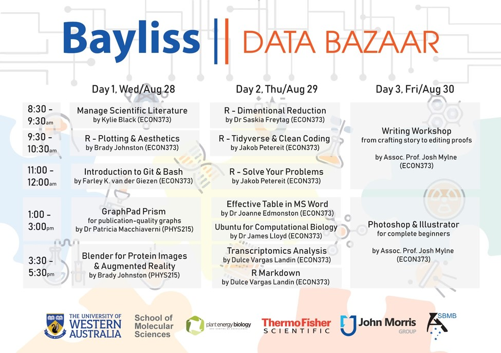

# Bayliss Data Bazaar 2020
## Introduction to Data Management and Processing

**Main Organizer:** Dr. Akila Wijerathna-Yapa | akila.yapa@research.uwa.edu.au | _Office Hours:_ Wednesdays 2:00 pm - 3:00 pm @ School of Molecular Sciences; Room 4.16 or by appointment

**Co-Organizer:** Prof. Valerie Verhasselt | valerie.verhasselt@uwa.edu.au | _Office Hours:_ by appointment

## Overview

This workshop will familiarise you with the basics of R through the RStudio interface and the tidyverse suite of R packages. You will be introduced to modern approaches to data analysis and visualization. The focus is on mastering basic skills and showing you where to go for help so you can undertake future analyses independently. By the end of this workshop you will know how to create and organize new “projects” in RStudio; read in data files; visualize data using the popular ggplot2 package; perform various data manipulation, summarization and modelling tasks; and create reproducible reports for bioinformatics analysis pipelines.Further, this course discusses the practical issues and techniques for data importing, tidying, transforming, and modeling. It offers a gentle introduction to techniques for processing big data. Programming is a cross-cutting aspect of the course. Participants will gain experience with data science tools through short assignments. The course work includes a term project based on real-world data. Required topics include: Data management and processing: definition &amp; background; Data transformation; Data import; Data cleaning; Data modeling; Relational and analytic databases; Basics of Excel; Programming in R; Data processing pipelines, connecting multiple data management and analysis components; Interaction between the capabilities and requirements of data analysis methods (data structures, basic statistics) and the choice of data storage and management tools; Repeatable and reproducible data analysis.

Most bioinformatics tools are designed to be run from the command line hence the ability to run simple command line programs is an essential bioinformatics skill. This workshop will familiarise you with the basics of the Unix command line interface. We will show you how to navigate the file structure, run simple programs with arguments and open files. To keep it relevant to bioinformatics, we will demonstrate the samtools program and learn how to peer inside some common bioinformatic file formars (e.g. BAM file and fastq files) 

In this course, we will introduce you to the different types of scientific articles and provide an outline of how to write an original research article describing your original scientific research.To enable you to write scientific research articles that can be published and to equip them with skills to cite and manage references/ bibliography while writing using a reference management tool such as EndNote.

## Course Material and Schedule

**Course Material** [Bayliss Data Bazaar Instructions Manual](https://docs.google.com/document/d/1EdbrjD-_NtXWf_3XkClu75dB_qhUQWmbxrD9-IgBNlM/edit#)

**Schedule:** 8.00 am - 5:00 pm

**Location:** 373 Economics & commerce conference room, PHYS: [ 215] Lecture Room 

**Dates:** 28th - 30th August 2020

## Teaching team
**TA: Assoc.Prof. Josh Mylne** | joshua.mylne@uwa.edu.au

**TA: Dr. Jakob Petereit** | jakob.petereit@research.uwa.edu.au

**TA: Dr. Brady Johnston** | brady.johnston@research.uwa.edu.au

**TA: Dr. Patricia Macchiaverni** | patricia.macchiaverni@uwa.edu.au

**TA: Farley Kwok van der Giezen** | farley.kwokvandergiezen@research.uwa.edu.au

**TA: Dr. Saskia Freytag** | saskia.freytag@perkins.uwa.edu.au

**TA: Dr. Joanne Edmondston** | joanne.edmondston@uwa.edu.au

**TA: Dr.James Lloyd** | james.lloyd@uwa.edu.au

**TA: Dr. Dulce Vargas Landin** | dulce.vargaslandin@research.uwa.edu.au

**TA: Kylie Black** | kylie.black@uwa.edu.au

**Required Textbooks:** 
[**R for Data Science**](http://r4ds.had.co.nz/) by Hadley Wickham and Garrett Grolemund 
[**Text Mining with R**](https://www.tidytextmining.com) by Silge and Robinson
[**Advanced R**](http://adv-r.had.co.nz/) by Hadley Wickham
[**R Packages**](http://r-pkgs.had.co.nz) by  Hadley Wickham

## Timetable

***

 {width=750px}

***

