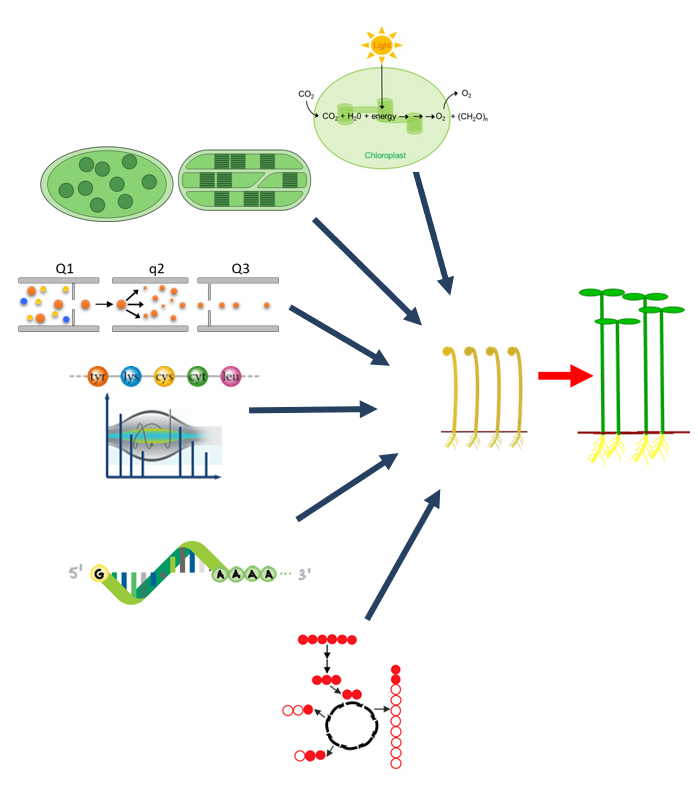

## Overview

Molecular Plant Physiology is the study of the biochemical and molecular mechanisms that underlie the growth, development, and physiological responses of plants to their environment. It involves the study of how plants acquire and utilize nutrients, how they respond to biotic and abiotic stresses, and how they regulate their growth and development.

Researchers in the field of Molecular Plant Physiology use a variety of techniques to investigate plant processes at the molecular level, including molecular biology, genomics, transcriptomics, proteomics, and metabolomics. By understanding the molecular mechanisms that govern plant physiology, we can develop new strategies for improving crop yields, enhancing plant resistance to pests and diseases, and mitigating the effects of climate change on plant growth and development.

Overall, Molecular Plant Physiology plays a crucial role in advancing our understanding of plant biology and providing solutions to some of the challenges facing agriculture and food security today.

***

 

***

